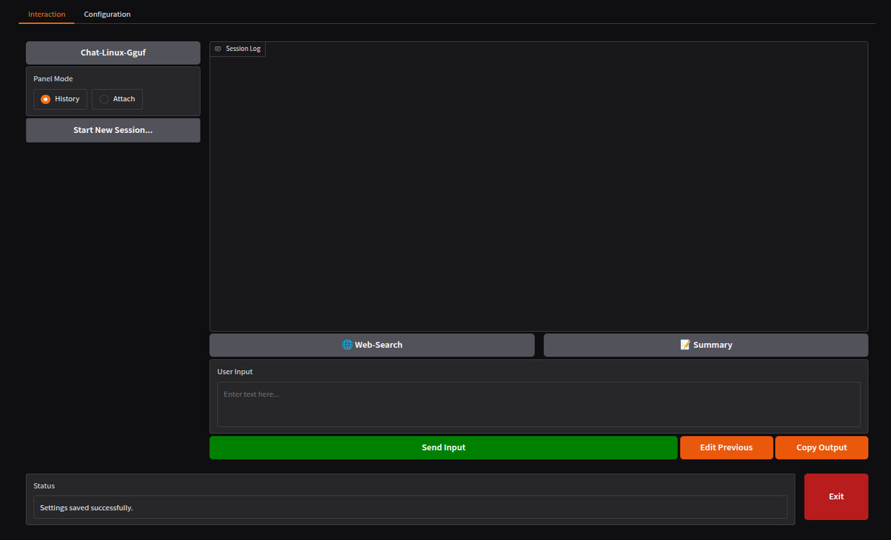
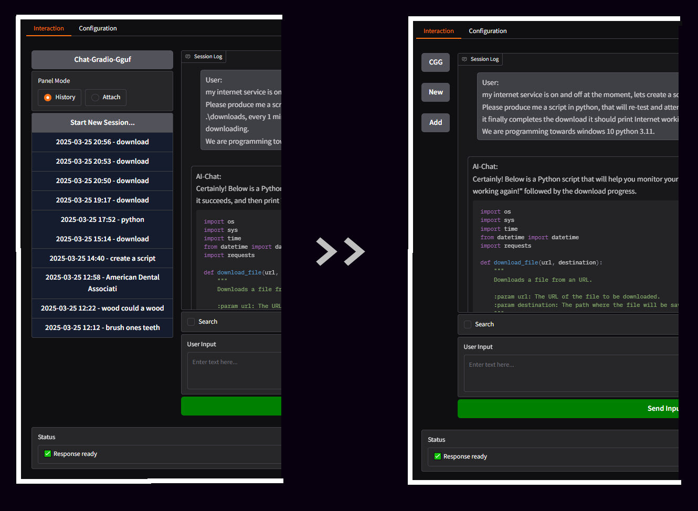
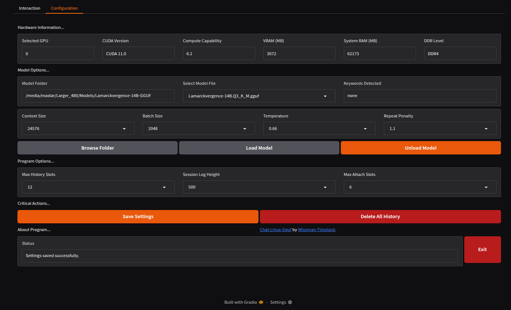

# 

Status: Alpha - Progression/BugFixing/Correction (Early Stage).

### Description
Chat-Linux-Gguf is the Ubuntu version of [Chat-Gradio-Gguf](https://github.com/wiseman-timelord/Chat-Gradio-Gguf) (which runs on Windows). So, the plan for the differences are...
- .sh instead of .bat, as well as program the scripts for specifically linux/ubuntu.
- Cuda Only, gpu must still be selectable. Installer will only have options for Cuda 11 and Cuda 12. There will also be some optimization/cleanup after
- The user must install cuda toolkit themselves.
- The scripts MUST use unified memory, so as to do the processing on the selected card, while loading models to system+gpu memory optimally. There will be no requirement for calculating how many layers to load to the GPU, we will assume that the models will load on the system memory available. optimize/cleanup functions/processes for removal of the calculations.

### Demonstration
- The "Interaction" page, where the conversation happens...


- The collapseable Left Panel on the `Interaction` page...


- The "Configuration" page - for configuration of, models and hardware, and relevant components, as well as ui customization...


- The `Bash Menu` is looking good...
```
===========================================================================================================
    Chat-Linux-Gguf: Bash Menu                                                                             
===========================================================================================================


    1. Run Main Program                                                                                    

    2. Run Installation                                                                                    

    3. Run Validation                                                                                      


===========================================================================================================
Selection; Menu Options = 1-3, Exit Bash = X: 


```
- The `launcher.py` entry point for main "Chat-Linux-Gguf" program... 
```
===========================================================================================================
    Chat-Linux-Gguf: Launcher                                                                              
===========================================================================================================

Checking environment...                                                                                    
Starting Chat-Linux-Gguf...                                                                                
[2025-06-24 15:52:53] INFO: Activated: .venv
Starting launcher
Launcher initializing
Directory set
Data directory: /media/mastar/Progs_250/Programs/Chat-Linux-Gguf/Chat-Linux-Gguf-A069/data
RAM: 62173MB
DDR: DDR4
ggml_cuda_init: GGML_CUDA_FORCE_MMQ:    no
ggml_cuda_init: GGML_CUDA_FORCE_CUBLAS: no
ggml_cuda_init: found 1 CUDA devices:
  Device 0: NVIDIA GeForce GTX 1060 3GB, compute capability 6.1, VMM: yes
Loading config
Config loaded
Launching interface
* Running on local URL:  http://127.0.0.1:7860
* To create a public link, set `share=True` in `launch()`.


```
- Installer currently (my fav part being `Binary compiled successfully`)...
```
===============================================================================
    Chat-Linux-Gguf: Installer
===============================================================================

Note: Installation may require sudo for system dependencies.
WARNING: This will delete existing ./data and ./.venv directories.
Continue? (y/N): y
Preparing installation...
[2025-06-21 12:48:12] INFO: Deleted: data
[2025-06-21 12:48:14] INFO: Deleted: .venv
Starting installer...
[2025-06-21 12:48:16] INFO: Installing Chat-Linux-Gguf
[2025-06-21 12:48:17] INFO: Verifying system...
[2025-06-21 12:48:18] INFO: Detected architectures: 61
[2025-06-21 12:48:19] INFO: Detected GPUs:
[2025-06-21 12:48:19] INFO: [0] NVIDIA GeForce GTX 1060 3GB ✓UM VRAM: 3072MB
[2025-06-21 12:48:20] INFO: Auto-selected GPU: 0
[2025-06-21 12:48:21] INFO: System Summary:
[2025-06-21 12:48:21] INFO: CUDA: 11.0
[2025-06-21 12:48:21] INFO: Driver: 570.133.07
[2025-06-21 12:48:21] INFO: GPU: 0
[2025-06-21 12:48:22] INFO: Installing system dependencies
[2025-06-21 12:48:23] INFO: Cleaning problematic repositories
[2025-06-21 12:48:23] WARNING: CUDA repo version mismatch detected
[2025-06-21 12:48:23] WARNING: Consider updating CUDA keyring
[2025-06-21 12:48:24] INFO: Installing software-properties-common
[2025-06-21 12:48:24] INFO: software-properties-common installed
[2025-06-21 12:48:25] INFO: Adding GCC Toolchain PPA
[2025-06-21 12:48:31] INFO: PPA added
[2025-06-21 12:48:32] INFO: Enabling universe repository
[2025-06-21 12:48:37] INFO: Universe enabled
[2025-06-21 12:48:38] INFO: Updating package lists
[2025-06-21 12:48:40] WARNING: Toolchain PPA unavailable, continuing
[2025-06-21 12:48:41] INFO: Package lists updated
[2025-06-21 12:48:42] INFO: Installing build tools
[2025-06-21 12:48:43] INFO: Build tools installed
[2025-06-21 12:48:44] INFO: Installing GCC 9
[2025-06-21 12:48:44] INFO: Configuring GCC alternatives
[2025-06-21 12:48:44] INFO: Active GCC: gcc (Ubuntu 9.5.0-6ubuntu2) 9.5.0
[2025-06-21 12:48:45] INFO: Verifying cmake installation
[2025-06-21 12:48:45] INFO: CMake verified
[2025-06-21 12:48:46] INFO: Installing dev libraries
[2025-06-21 12:48:47] INFO: Dev libraries installed
[2025-06-21 12:48:48] INFO: Installing Python dev
[2025-06-21 12:48:49] INFO: Python dev installed
[2025-06-21 12:48:50] INFO: Installing utilities
[2025-06-21 12:48:50] INFO: Utilities installed
[2025-06-21 12:48:51] INFO: System dependencies completed
[2025-06-21 12:48:52] INFO: Setting up llama.cpp
[2025-06-21 12:48:53] INFO: Cloning attempt 1/3
[==========] 100% 48.8MB/48.8MB 57s/57s
[2025-06-21 12:49:50] INFO: Clone complete
[2025-06-21 12:49:51] INFO: Compiling llama.cpp...
[2025-06-21 12:49:52] INFO: Checking compiler compatibility
[2025-06-21 12:49:53] INFO: CUDA 11.0 max gcc: 9
[2025-06-21 12:49:54] INFO: Using gcc-9
[2025-06-21 12:49:55] INFO: Compiler: gcc-9 (Ubuntu 9.5.0-6ubuntu2) 9.5.0
[2025-06-21 12:49:56] INFO: Applied patch for __builtin_assume
[2025-06-21 12:49:57] INFO: Configuring CMake build
[2025-06-21 12:50:00] INFO: CMake configured successfully
[2025-06-21 12:50:01] INFO: Compiling binary...
[2025-06-21 12:51:55] INFO: Make output: [  0%] Building C object ggml/src/CMakeFiles/ggml-base.dir/ggml.c.o
...
(building the binary output zzz..)
...
[2025-06-22 20:43:45] INFO: Binary compiled successfully
[2025-06-22 20:43:46] INFO: Installing binary...
[2025-06-22 20:43:46] INFO: Binary installed from /media/mastar/Progs_250/Programs/Chat-Linux-Gguf/Chat-Linux-Gguf-A069/data/temp/llama.cpp/build/bin/llama-cli to /media/mastar/Progs_250/Programs/Chat-Linux-Gguf/Chat-Linux-Gguf-A069/data/llama-cpp/llama
[2025-06-22 20:43:47] INFO: Testing binary...
[2025-06-22 20:43:47] INFO: Binary test passed
[2025-06-22 20:43:48] INFO: Creating Python env...
[2025-06-22 20:43:49] INFO: Creating virtual env
[2025-06-22 20:43:51] INFO: Virtual env created
[2025-06-22 20:43:52] INFO: Upgrading pip...
[2025-06-22 20:44:16] INFO: Pip upgraded successfully
[2025-06-22 20:44:17] INFO: Installing basic packages
[2025-06-22 20:53:31] INFO: Basic packages installed
[2025-06-22 20:53:32] INFO: Compiling llama-cpp-python
[2025-06-22 20:53:32] INFO: Checking compiler compatibility
[2025-06-22 20:53:33] INFO: CUDA 11.0 max gcc: 9
[2025-06-22 20:53:34] INFO: Using gcc-9
[2025-06-22 20:53:35] INFO: Compiler: gcc-9 (Ubuntu 9.5.0-6ubuntu2) 9.5.0
[2025-06-22 20:54:53] INFO: llama-cpp-python installed
[2025-06-22 20:54:54] INFO: Python env complete
[2025-06-22 20:54:55] INFO: Creating config...
[2025-06-22 20:54:56] INFO: Removing existing data
[2025-06-22 20:54:57] INFO: Creating data directories
[2025-06-22 20:54:57] INFO: Data directories created
[2025-06-22 20:54:58] INFO: Writing config file
[2025-06-22 20:54:58] INFO: Config file written
[2025-06-22 20:54:59] INFO: Config verified
[2025-06-22 20:55:00] INFO: Install complete
[2025-06-22 20:55:00] INFO: Run: /media/mastar/Progs_250/Programs/Chat-Linux-Gguf/Chat-Linux-Gguf-A069/.venv/bin/python launcher.py
[2025-06-22 20:55:00] INFO: Installation completed
[2025-06-22 20:55:01] INFO: Virtual environment status reset


```
- Validation script seems to be ok...
```
===============================================================================
    Chat-Linux-Gguf: Validation
===============================================================================

Running validation checks...
[2025-06-23 00:36:40] INFO: Activated: .venv
• Validating environment...
✓   - Ubuntu version (24.1)
✓   - CUDA version (11.0)
✓   - Unified memory support (GPU 0)
✓   - venv exists
✓   - python exists
✓   - llama bin exists
✓   - config exists
✓   - data temp exists
✓   - data history exists
✓   - data vectors exists
• Validating libraries...
✓   - gradio
✓   - requests
✓   - pyperclip
✓   - yake
✓   - psutil
✓   - duckduckgo-search
✓   - newspaper3k
✓   - langchain-community
✓   - pygments
✓   - lxml_html_clean
✓   - llama-cpp-python
• Validating configuration...
✓   - llama binary path
✓   - use python bindings
✓   - unified memory enabled
✓   - VRAM allocation
✓   - config field model_dir
✓   - config field n_batch
✓   - config field vram_mb
• Testing CUDA integration...
✓   - CUDA initialization

Validation successful!

```


### Requirements
- O.S. - Linux Only (Ubuntu ~24.10 recommended).
- Python - Unknown min version (will be assessed after working version, but presumed 3.8+).
- G.P.U. - nVidia with nVidia driver 450.80+, may be used/compute GPU. 
- Cuda Toolkit - You must install, Version [11.8](https://developer.nvidia.com/cuda-11-8-0-download-archive) or [12.9](https://developer.nvidia.com/cuda-12-9-0-download-archive), depending upon Cuda level of card for processing.
- R.A.M. - Models are stored in Unified Memory, and processes on the GPU. This method should cover most model cases.

### Usage
1. Download latest `Release` version, and expand to a suitable location, then open a terminal in that location.
2. Make "Chat-Linux-Gguf.sh" executable with `sudo chmod +x ./Chat-Linux-Gguf.sh`.
3. To run the installation of requirements `sudo bash ./Chat-Linux-Gguf.sh`, then select option `2. Run Installation` from the menu, this may take some time (hopefully work for you, or try it again best advice for now.).
4. Having returned to the bash menu after successful install, one would use option `1. Run Main Program`, to load the gradio interface in the popup browser window.
5. Go to `Configuration` tab in the gradio interface, configure the, hardware, models, etc, to your liking, ensure to use sensible values, for optimal results, then load model.
6. Go back to `Conversation` tab in the gradio interface...TBA
- For normal usage after install you may use the program via command `bash ./Chat-Linux-Gguf.sh` (ie without sudo hopefully).

# Development
- Need to fix model handling, currently no models load. Issue was old version of llama (that was being used due to being compatible with [chat]). Solution is to use/install, llama-cpp and llama_cpp[chat], v3.9, as its 2 separate libraries now (this is what was confusing the AI). It was all to do with chat completion. Note, tried gguf, but i would need to use tables to convert values??!!. 
- we will want an additional bar showing `GPU Ram Usage / System Ram Usage`. Somehow bars on top or bottom optionally, for, VRAM / SRAM, for selected hardware.
- Ensure that firstly it will calculate the rough model loaded size, and if it will fit on the GPU, then load to GPU, otherwise there will be an option in configuration for, upon the event of model is too large for gpu then if it will switch between, Unified Memory or On GPU with Excess layers in system memory. If all fits in GPU Ram, then only 1 memory usage bar displayed for VRAM.

### File Structure
Details of file structure...
- Core Project files...
```
project_root/
│ Chat-Linux-Gguf.sh
│ installer.py
│ validater.py
│ launcher.py
├── media/
│ └── project_banner.jpg
├── scripts/
│ └── interface.py
│ └── models.py
│ └── prompts.py
│ └── settings.py
│ └── temporary.py
│ └── utlity.py
```
- Installed/Temporary files...
```
project_root/
├── data/
│ └── persistent.json
├── data/vectors/
└─────── *
├── data/temp/
└────── *
├── data/history
└────── *
├── .venv/ (if we are still using this)
└────── *
```

### Notation
- Ubuntu ChatBots now? In-short Ubuntu 24.10 has allows to install, "RX 470" as main with "1060 3GB" as compute for cuda, with no issues, thanks to help from [X-Grok](www.x.com).
- Advise [OpenSnitch](https://github.com/evilsocket/opensnitch) for easier firewall rule creation/management, download and install the .deb file (with optional assistance from AI), as found `APT/Software Manager` installer has issues. 
- Produced via manually prompting AI with NotePadNext v0.12, making use of AI Systems, Grok, X-Grok, DeepSeek, Claude.
